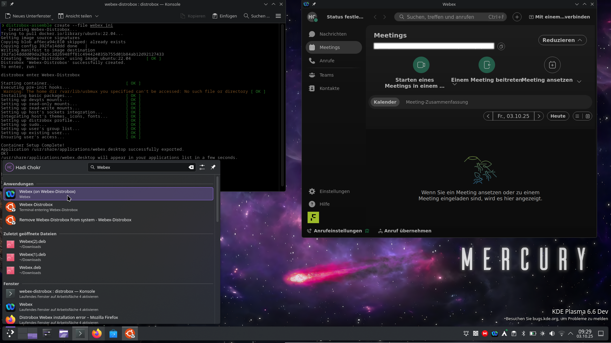

# Webex in Distrobox

Run Cisco Webex inside a Distrobox container based on **Ubuntu 22.04**, with environment variables forcing **X11/XWayland** (the native Wayland support of Webex is currently buggy).

## Usage

### 1. Download the `webex.ini`
You can either:
- Click on the file in this repository and use the **Download** button,  
- Or directly grab it via `wget`:

```bash
wget https://raw.githubusercontent.com/silverhadch/webex-distrobox/refs/heads/master/webex.ini
```

---

### 2. Install Distrobox
Make sure you have [Distrobox](https://repology.org/project/distrobox/versions) installed on your system.  
Most distros provide it in their package repositories.

---

### 3. Create the container
Run:

```bash
distrobox assemble create --file webex.ini
```

This will:
- Pull the `ubuntu:22.04` image,  
- Update the container,  
- Download and install Webex,  
- Apply environment flags to force **X11/XWayland** instead of native Wayland,  
- Export the application so you can simply launch **Webex** from your desktop’s application menu.

---

## Showcase

Here is Webex running on **EndeavourOS**, an Arch-based distribution which is **not officially supported by Webex**.  

Thanks to **Distrobox**, the container runs the userspace of **Ubuntu 22.04 LTS** (an officially supported distro) natively on the host Linux kernel with access to host devices.

✅ Tested on EndeavourOS:
- Joining and hosting meetings  
- Messaging  
- Calling with the integrated softphone  



---

## License
BSD 3-Clause
